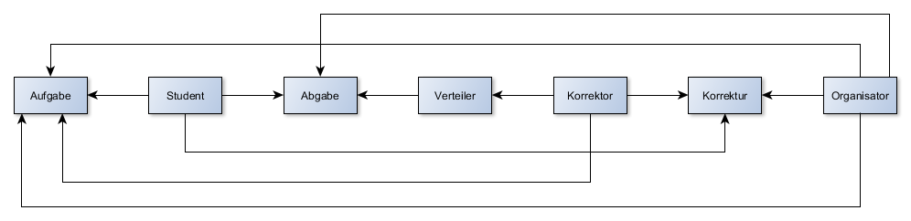

= Professionelle Softwareentwicklung: Projekt 2

== Aufgabe 1: Personas

|===
|Name | Hintergrund | Ziel

a| Dennis

|

Dennis studiert im achten Semester Informationswissenschaft and der HHU. Er bearbeitet dieses Semester sowohl das "Programmierpraktikum" als auch das "DBS-Programmierpraktikum ".

Das erste Mal programmiert hat er in der Veranstaltung "Programmierung" im ersten Semester.
Er ist anderen Betriebssystemen gegenüber nicht abgeneigt, hat dennoch auf all seinen Geräten Win10 installiert.

An der aktuellen Situation der Abgabesysteme ärgert ihn nicht nur die langsame Geschwindigkeit, sondern vor allem, dass es keine Einheitliche Lösung, die Universitätsübergreifend genutzt wird gibt.
Er wünscht sich außerdem eine Funktion seine Kurse für sich selber grafisch anzuordnen oder farblich zu gestalten, da es ihm bereits passiert ist, dass er nach einer langen Nacht ohne viel Schlaf ein Projekt bei der Abgabe für "Programmierpraktikum" anstatt "DBS-Programmierpraktikum" abgegeben hat.

|
Dennis möchte die letzten Scheine, die er noch für seinen Bachelor benötigt möglichst reibungslos abschließen. Dazu zählt unter anderem das "Programmierpraktikum".
|===

|===
|Name | Hintergrund | Ziel

a| Daniel

|

Daniel studiert Informatik, er hat das  "Programmierpraktikum" bereits vor langem abgeschlossen, nun arbeitet er als Korrektor für das "Programmierpraktikum" um sich etwas
Geld neben seinem Studium dazu zu verdienen.

Daniel programmiert bereits seit Jahren und ist auch in seiner Freizeit in der Modding Community einiger Computerspiele unterwegs. Er zieht es vor unter Linux zu arbeiten,
da er aber auch gerne Computerspiele spielt hat er auf seinem Rechner zuhause ebenfalls Windows installiert.

Ihm ist wichtig, dass die Abgaben der Studenten unter allen Korrektoren gleichmäßig verteilt werden, wobei es ihn nicht sauer machen würde, wenn er weniger zu tun hat.
Am liebsten hätte er ein Tool, das direkt nach Abgabefrist die Projekte and die Korrektoren verteilt. Daniel wünscht sich außerdem, dass das Abgabesystem eine Funktion hätte,
mit der er bei Nachfragen zur Korrektur mit dem Studenten kommunizieren kann, ohne seine E-Mail zu benutzen. Am liebsten hätte er diese Funktion aber um immer direkt zu wissen
auf welche Abgabe sich der Schriftverkehr bezieht.
|
Daniel möchte sich während er dabei ist sein Studium abzuschließen etwas Geld dazu verdienen mit etwas das ihm Spaß macht. Außerdem freut er sich, wenn er anderen Studenten weiterhelfen kann.
|===

== Aufgabe 2: Abgabesystem

Komponenten des Workflows für das Abgabesystem sind unter die drei Typen von Nutzern, dazu zählen die Organisatoren, Korrektoren und Studenten. Im Sinne des Information Hidings könnten Informationen,
wie z.B. der Name des Nutzers oder die Matrikelnummer des Studenten, ausschließlich in diesem Teil des Programms angelegt werden.

Eine Modul ermöglicht es allen Nutzern die Aufgaben herunterzuladen. Dabei macht es keinen Unterschied ob der Nutzer Student oder Organisator ist, alle können auf dieses Modul zugreifen.

Der Student benötigt außerdem Zugriff auf ein Modul, dass es ihm erlaub eine Abgabe zu tätigen. Dabei wird die Abgabe in die Datenbank geladen und durch eine Art Kennung dem Studenten zugewiesen.

Die Abgaben werden von einem Modul gesammelt. Wenn die Abgabefrist vorbei ist kann vom Organisator die Verteilung an die Korrektoren gestartet werden. Eine manuelle Verteilung ist ebenfalls von Nöten
falls eine verspätete Abgabe eingereicht wird.

Organisatoren benötigen ebenfalls Zugriff auf die Abgabe eines Studenten für den Fall, dass sie verspätete Abgaben hochladen müssen.

Der Korrektor benötigt ein Modul, dass es ihm erlaubt die ihm vom Verteiler zugewiesenen Abgaben herunterzuladen. Das Modul könnte so implementiert werden, dass es Organisatoren
Zugriff auf alle Abgaben gibt. Studenten können jedoch nur ihre eigene Abgabe einsehen.

Die vom Korrektor erstelle Korrektur muss ebenfalls über ein Modul hochgeladen und der jeweiligen Abgabe zugeordnet werden.

Außerdem wir ein Modul benötigt, um dem Organisator Einblick auf alle Korrekturen zu gewähren.
Dieses Modul sollte außerdem dem Korrektor Einsicht auf eine Korrekturen geben, sowie dem Studenten auf die seiner Abgabe.

== Aufgabe 3: Namensfindung

Ein möglicher Name für das neue System wäre Informatikportal angelehnt an das Studierendenportal,  natürlich nur solange das System nur im Rahmen der Informatik genutzt wird.

== Aufgabe 4: Funktionsumfang

Ein Teil des neuen Abgabesystems könnte eine Funktion, wie in Aufgabenteil 1 bereits angedeutet, die es Korrekteren ermöglicht die  Abgabe zu kommentieren.
Der Student sollte außerdem die Möglichkeit haben nach seiner Korrektur über dieses System mit dem Korrektor zu kommunizieren falls Rückfragen vorhanden sind.
Dieses System würde den Schriftverkehr über die Universitäts-E-Mail überflüssig machen, was von Vorteil sein kann, da es schonmal vorkommt, dass das Postfach der
Uniadresse einige Tage nicht auf neue Nachrichten geprüft wird. In dem Zusammenhang wäre eine optionale Benachrichtigung über ein neues Kommentar zu einer Korrektur gut vorstellbar.
Sollte es bei einer Korrektur zu einem Streitfall kommen wäre es praktisch, wenn Professoren bzw. die Zuständigen für die Veranstaltung Zugriff auf das Geschriebene haben.

Eine weitere praktische Funktion, die das neue Abgabesystem haben könnte, wäre ein System, dass dem Verantwortlichen der Veranstaltung ermöglicht einzustellen ob und
wenn wie lange es eine Nachbearbeitungszeit gibt. Diese würde dann automatisch ablaufen sobald eine Korrektur eingereicht wurde. In diesen Kontext wäre auch eine Funktion,
die Joker wie in dieser Veranstaltung berücksichtig und dem Studenten die Möglichkeit gibt über das System den Joker direkt einzulösen. Länge und Anzahl
der Joker müssten natürlich im Vorfeld einstellbar sein. Dies würde ebenfalls den E-Mail-Verkehr reduzieren und vermutlich auch den Umgang mit solchen Regelungen erleichtern und
übersichtlicher machen. Es wäre auch gut, wenn der Admin der Veranstaltung die Möglichkeit hat die Abgabefrist für Studenten zu erhöhen, falls dieses Mal von Nöten sein sollte.

== Kommentare

_Falls Sie noch zusätzliche Anmerkungen für die Korrektur haben_
